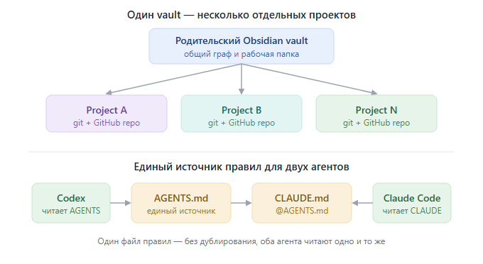

# 📦 New Project Rules — переносимый стандарт старта проектов

**Один шаблон, с которого начинается любой новый проект — и который одинаково
понимают человек, Git, Obsidian и AI-агенты (Codex и Claude Code).**



## Зачем это нужно

Каждый новый проект обычно начинается с одного и того же хаоса: где держать
заметки, как структурировать документацию, что писать в инструкциях для
AI-ассистента, как не закоммитить лишнее. Этот набор закрывает вопрос раз и
навсегда — **одна команда создаёт чистую, согласованную структуру**, которую не
нужно придумывать заново.

Ключевая идея: **один общий vault содержит отдельные проекты**:

- 🗂️ родительская папка — **Obsidian vault** с общим графом;
- 🌳 каждая папка проекта — корень отдельного **Git-репозитория**;
- ☁️ каждому проекту соответствует отдельный **GitHub-репозиторий**.

Никаких API, синхронизаций и вторых копий. Markdown редактируется напрямую и
сразу является и заметкой, и файлом репозитория.

## Главные принципы

| Принцип | Что это даёт |
|---|---|
| **Один источник правил** | `AGENTS.md` — единственный файл правил. `CLAUDE.md` содержит лишь `@AGENTS.md`, поэтому Codex и Claude Code читают **одно и то же** без дублирования. |
| **Двухуровневая документация** | Обязательное ядро `README / AGENTS / INDEX / PROJECT` создаётся всегда. Архитектура, ADR, тесты, безопасность и т.д. — **только когда реально нужны**. Никаких пустых файлов-заглушек. |
| **Машиночитаемое — первично** | OpenAPI, lock-файлы, SBOM, `CODEOWNERS` — источник истины. Markdown их **объясняет и связывает, а не дублирует**. |
| **Связность через граф** | Заметки соединены wikilinks, `INDEX.md` — живая карта проекта. |
| **Безопасность по умолчанию** | Секреты, токены и ключи не попадают в репозиторий. Игнорируются только локальные файлы. |
| **Переносимость** | Работает на macOS, Linux и Windows; проект не зависит от исходного компьютера. |

## Что внутри

**⚙️ Скрипты автоматизации (sh + PowerShell):**

- `bootstrap-new-project` — создаёт новый проект из выбранного профиля;
- `setup-global-agents` — разово настраивает глобальные правила для Codex и
  Claude Code (безопасно, идемпотентно, не перетирает существующее);
- `add-agent-scope` — добавляет правила для отдельного подкаталога.

**🎚️ Профили под масштаб проекта:**

- `minimal` — только обязательное ядро;
- `software` — + архитектура, тесты, changelog;
- `operated` — + внешние действия, инструменты, интеграции, окружения;
- `all` — + API, модель данных, security и threat model.

**📚 Каталог шаблонов** — готовые заготовки для архитектуры, ADR, исследований,
ревью, тестирования, безопасности, интеграций и др.

**🤖 Правила для AI-агентов** — как вести себя в проекте: что коммитить, как
выбирать инструменты (приоритет существующего стека; спрашивать перед установкой
новых зависимостей), как организовывать вложенные инструкции.

## Как начать

```sh
# 1. Настроить глобальные правила (один раз на компьютере)
./scripts/setup-global-agents.sh

# 2. Создать новый проект
./scripts/bootstrap-new-project.sh "/path/to/My Project" "My Project" software
```

Дальше — создать проект внутри открытого Obsidian vault, создать для него
GitHub-репозиторий и работать. Codex и Claude Code сразу знают правила проекта.

> **Итог:** меньше рутины на старте, единая структура во всех проектах и
> AI-ассистенты, которые с первой минуты работают по вашим правилам.
